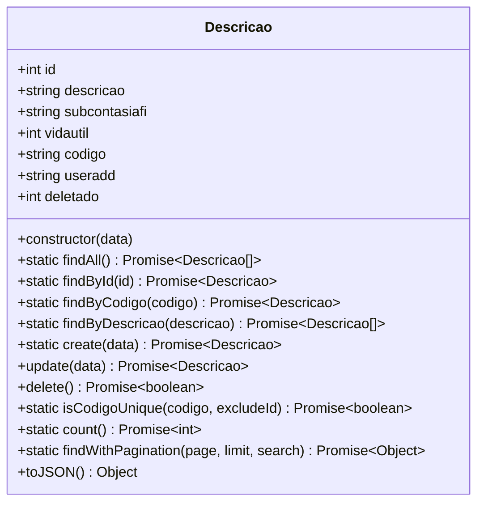

# Design Document: CRUD para Entidade "Descrição"

## 1. Visão Geral

Este documento descreve a implementação de um CRUD (Create, Read, Update, Delete) para a entidade "Descrição" no sistema PatrimonioTools. A implementação seguirá os mesmos padrões e estrutura já estabelecidos para a entidade "Responsável", mantendo a consistência arquitetural do sistema.

### 1.1 Objetivo
Implementar todas as funcionalidades necessárias para gerenciar registros da entidade "Descrição", incluindo operações de criação, leitura, atualização e exclusão, com as mesmas validações, tratamento de erros e padrões de interface utilizados para a entidade "Responsável".

### 1.2 Requisitos Funcionais
- Criar novos registros de descrição
- Listar todas as descrições
- Buscar descrições por ID
- Atualizar registros existentes
- Excluir registros
- Validação de dados
- Tratamento de erros
- Interface de usuário responsiva

## 2. Arquitetura

A implementação seguirá a arquitetura MVC (Model-View-Controller) já estabelecida no sistema:

```
Frontend (React) ←→ Backend API (Node.js/Express) ←→ Banco de Dados (PostgreSQL)
```

### 2.1 Estrutura de Diretórios
```
backend/
├── src/
│   ├── models/
│   │   └── Descricao.js
│   ├── controllers/
│   │   └── descricaoController.js
│   ├── services/
│   │   └── descricaoService.js
│   ├── routes/
│   │   └── descricoes.js
│   └── utils/
│       └── validation.js (atualizações)
└── database-setup.sql (atualizações)

frontend/
├── src/
│   ├── components/
│   │   └── descricoes/
│   │       ├── DescricaoForm.jsx
│   │       ├── DescricaoList.jsx
│   │       ├── DescricaoTableList.jsx
│   │       └── DescricaoSearch.jsx
│   ├── hooks/
│   │   └── useDescricoes.js
│   ├── context/
│   │   └── DescricaoContext.jsx
│   ├── services/
│   │   └── descricaoService.js
│   └── pages/
│       └── Descricoes.jsx
```

## 3. Modelo de Dados

### 3.1 Estrutura da Tabela
Com base no INSERT fornecido, a tabela `tbldescricao` terá a seguinte estrutura:

```sql
CREATE TABLE IF NOT EXISTS tbldescricao (
    id SERIAL PRIMARY KEY,
    descricao VARCHAR NOT NULL,
    subcontasiafi VARCHAR,
    vidautil INTEGER,
    codigo VARCHAR NOT NULL UNIQUE DEFAULT '',
    useradd VARCHAR,
    deletado INTEGER DEFAULT 0
);

-- Criar generator/sequence para o campo codigo
CREATE SEQUENCE IF NOT EXISTS seq_descricao_codigo
    START WITH 1000000000
    INCREMENT BY 1
    MINVALUE 1000000000
    MAXVALUE 9999999999
    CACHE 1;

-- Função para gerar o próximo código
CREATE OR REPLACE FUNCTION generate_descricao_codigo()
RETURNS VARCHAR AS $$
BEGIN
    RETURN CAST(nextval('seq_descricao_codigo') AS VARCHAR);
END;
$$ LANGUAGE plpgsql;

-- Trigger para preencher o código automaticamente antes de inserir
CREATE OR REPLACE FUNCTION fill_descricao_codigo()
RETURNS TRIGGER AS $$
BEGIN
    IF NEW.codigo IS NULL OR NEW.codigo = '' THEN
        NEW.codigo = generate_descricao_codigo();
    END IF;
    RETURN NEW;
END;
$$ LANGUAGE plpgsql;

CREATE TRIGGER trg_fill_descricao_codigo
    BEFORE INSERT ON tbldescricao
    FOR EACH ROW
    EXECUTE FUNCTION fill_descricao_codigo();
```

### 3.2 Campos da Entidade
| Campo | Tipo | Obrigatório | Descrição |
|-------|------|-------------|-----------|
| id | SERIAL | Sim | Identificador único (chave primária) |
| descricao | VARCHAR | Sim | Descrição do item |
| subcontasiafi | VARCHAR | Não | Subconta SIAFI |
| vidautil | INTEGER | Não | Vida útil em anos |
| codigo | VARCHAR | Sim (auto-gerado) | Código único do item, gerado automaticamente pelo sistema |
| useradd | VARCHAR | Não | Usuário que adicionou o registro |
| deletado | INTEGER | Não | Indicador de exclusão lógica (0 = ativo, 1 = deletado) |

### 3.3 Modelo UML


## 4. Backend

### 4.1 Modelo (Descricao.js)
O modelo seguirá o mesmo padrão do `Responsavel.js`, implementando métodos estáticos para operações CRUD e métodos de instância para atualização e exclusão.

### 4.2 Serviço (descricaoService.js)
O serviço implementará a lógica de negócios, validações e tratamento de erros, seguindo o mesmo padrão do `responsavelService.js`.

### 4.3 Controlador (descricaoController.js)
O controlador gerenciará as requisições HTTP, utilizando as mesmas validações e padrões do `responsavelController.js`.

### 4.4 Rotas (descricoes.js)
As rotas seguirão o mesmo padrão de autenticação e organização do arquivo `responsaveis.js`.

## 5. Frontend

### 5.1 Componentes
- **DescricaoForm**: Formulário para criação e edição de descrições
- **DescricaoList**: Lista de descrições em formato de cards
- **DescricaoTableList**: Lista de descrições em formato de tabela
- **DescricaoSearch**: Componente de busca por descrição ou código

### 5.2 Hooks
- **useDescricoes**: Hook para gerenciar estado e operações da entidade
- **useDescricaoForm**: Hook específico para o formulário de descrição

### 5.3 Contexto
- **DescricaoContext**: Contexto para gerenciamento de estado global da entidade

### 5.4 Serviços
- **descricaoService**: Cliente HTTP para comunicação com a API

### 5.5 Página
- **Descricoes.jsx**: Página principal para gerenciamento de descrições

## 6. API Endpoints

### 6.1 Endpoints Disponíveis
| Método | Endpoint | Descrição |
|--------|----------|-----------|
| GET | `/api/descricoes` | Listar todas as descrições |
| GET | `/api/descricoes/:id` | Obter descrição por ID |
| GET | `/api/descricoes/codigo/:codigo` | Obter descrição por código |
| GET | `/api/descricoes/search/:termo` | Buscar descrições por termo |
| POST | `/api/descricoes` | Criar nova descrição |
| PUT | `/api/descricoes/:id` | Atualizar descrição |
| DELETE | `/api/descricoes/:id` | Excluir descrição |
| GET | `/api/descricoes/stats` | Obter estatísticas |

### 6.2 Estrutura de Requisição/Resposta

#### Criar Descrição (POST /api/descricoes)
**Request:**
```json
{
  "descricao": "Barra Vertical e Horizontal com espelho",
  "subcontasiafi": "03.03",
  "vidautil": 5,
  "useradd": "ianna"
}
```

*Nota: O campo "codigo" é gerado automaticamente pelo sistema e não precisa ser fornecido na criação.*

**Response:**
```json
{
  "success": true,
  "data": {
    "id": 1,
    "descricao": "BARRA VERTICAL E HORIZONTAL COM ESPELHO",
    "subcontasiafi": "03.03",
    "vidautil": 5,
    "codigo": "1000000331",
    "useradd": "ianna",
    "deletado": 0
  },
  "message": "Descrição criada com sucesso"
}
```

## 7. Validações

### 7.1 Backend
- **descricao**: Obrigatória, entre 2 e 255 caracteres
- **codigo**: Gerado automaticamente pelo sistema, único
- **vidautil**: Deve ser um número inteiro positivo entre 0 e 100
- **subcontasiafi**: Opcional, formato específico se fornecido
- **useradd**: Opcional, máximo 50 caracteres

### 7.2 Frontend
- Validações em tempo real nos campos do formulário
- Mensagens de erro específicas para cada campo
- Formatação automática (ex: uppercase para descrição)

## 8. Tratamento de Erros

### 8.1 Tipos de Erro
- **ValidationError**: Dados inválidos fornecidos pelo usuário
- **NotFoundError**: Registro não encontrado
- **ConflictError**: Violação de unicidade (código duplicado)
- **InternalServerError**: Erros internos do servidor

### 8.2 Mensagens de Erro
As mensagens seguirão o mesmo padrão do sistema, sendo claras e específicas para facilitar a correção pelos usuários.

## 9. Testes

### 9.1 Testes Unitários (Backend)
- Testes para todas as funções do modelo
- Testes para os métodos do serviço
- Testes para os controladores
- Testes de validação de dados

### 9.2 Testes de Integração
- Testes de API para todos os endpoints
- Testes de fluxo completo (criar, ler, atualizar, excluir)
- Testes de paginação e busca

### 9.3 Testes Frontend
- Testes de componentes
- Testes de hooks
- Testes de integração com a API
- Testes de usabilidade

## 10. Considerações de Segurança

### 10.1 Autenticação
Todos os endpoints exigirão autenticação via JWT, seguindo o mesmo padrão das rotas de responsáveis.

### 10.2 Autorização
A implementação seguirá o mesmo modelo de permissões já estabelecido no sistema.

### 10.3 Validação de Dados
- Todos os dados serão sanitizados antes de serem processados
- Uso de prepared statements para prevenir SQL Injection
- Validação rigorosa de tipos e formatos

## 11. Considerações de Performance

### 11.1 Indexação
- Índice na coluna `codigo` (UNIQUE)
- Índice na coluna `descricao` para buscas
- Índice na coluna `deletado` para filtros

### 11.2 Paginação
Implementação de paginação para listagens, evitando sobrecarga de dados.

### 11.3 Caching
Considerar implementação de caching para dados frequentemente acessados.

## 12. Generator de Código

O sistema inclui um generator automático para o campo `codigo` utilizando sequences do PostgreSQL. O generator:

1. Inicia com o valor 1000000000
2. Incrementa sequencialmente
3. É acionado automaticamente durante a inserção de novos registros
4. Pode ser personalizado conforme necessidade

Este mecanismo garante que cada descrição tenha um código único e sequencial sem necessidade de entrada manual.