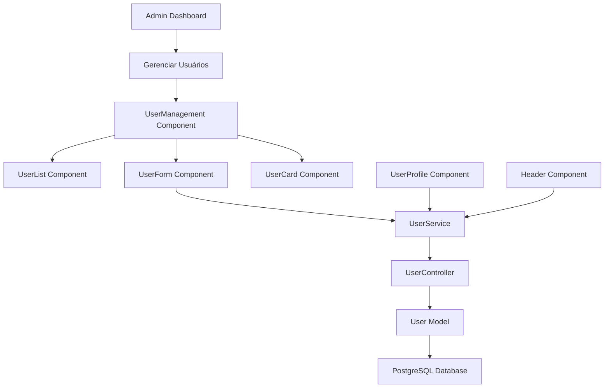
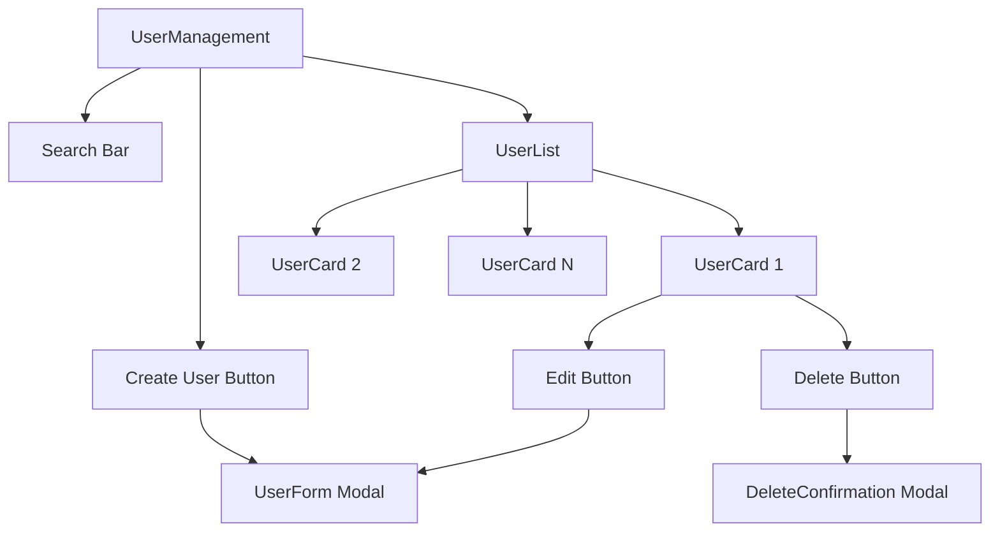
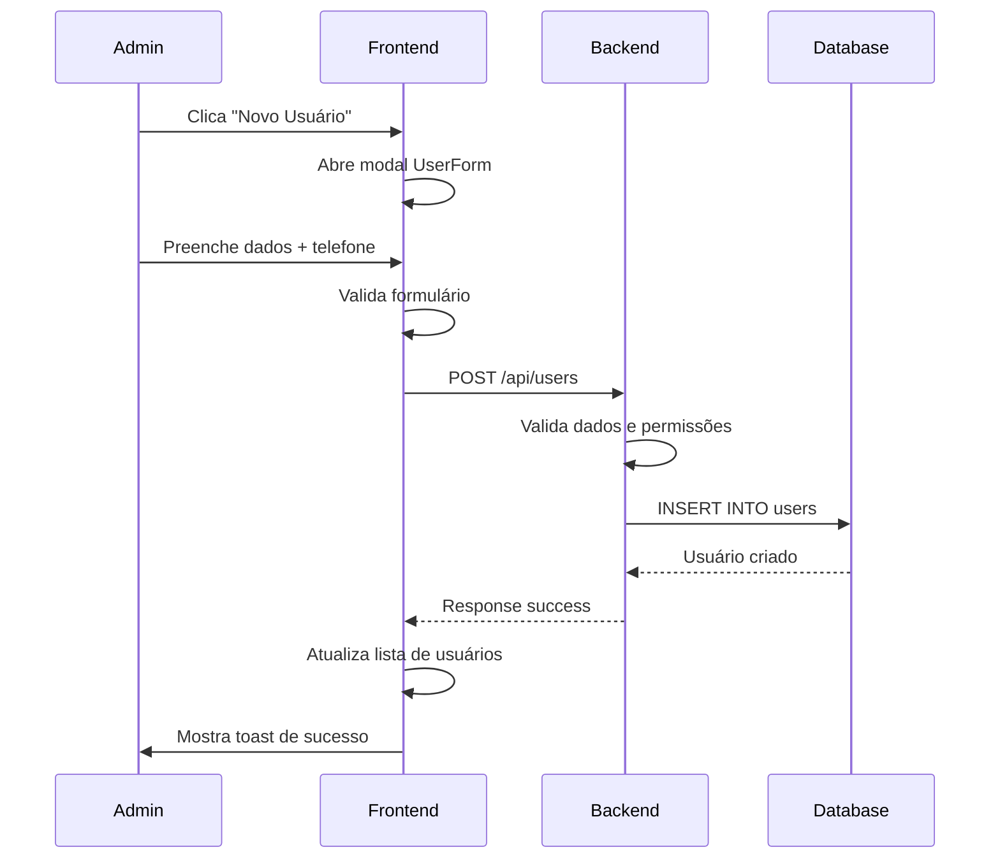
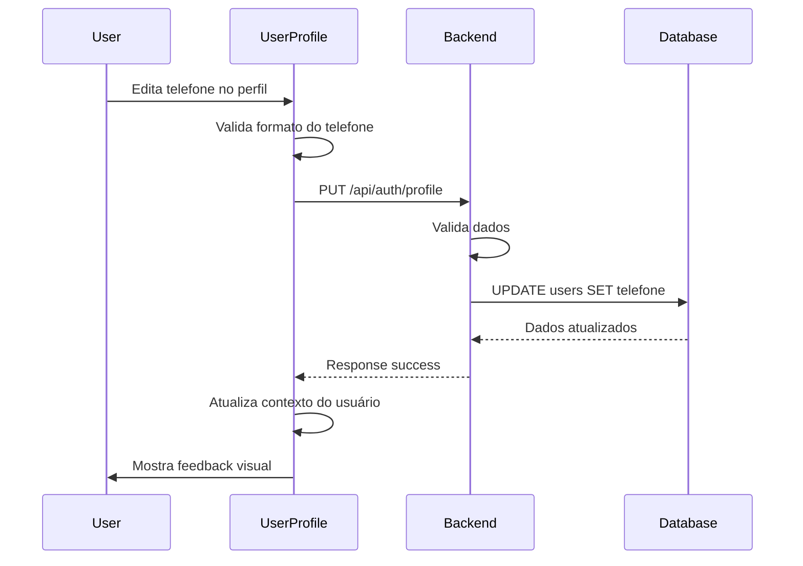

# Campo Telefone e Cadastro de Usuários pelo Admin

## Visão Geral

Este design especifica a implementação do campo telefone na tabela de usuários e a criação de funcionalidades de gerenciamento de usuários pelo administrador do sistema, incluindo cadastro, edição e listagem de usuários.

**Principais funcionalidades:**
- Adição do campo `telefone` na tabela de usuários
- Interface de cadastro de usuários para administradores
- Interface de listagem e gerenciamento de usuários
- Validação e formatação de números de telefone
- Integração com o perfil do usuário existente

## Arquitetura

### Modificações no Banco de Dados

#### Alteração da Tabela Users
```sql
-- Adicionar campo telefone na tabela users
ALTER TABLE users ADD COLUMN telefone VARCHAR(20);

-- Atualizar usuário admin existente com telefone padrão
UPDATE users SET telefone = '(83) 2101-1000' WHERE username = 'admin';
```

#### Schema Atualizado
```sql
CREATE TABLE users (
    id SERIAL PRIMARY KEY,
    username VARCHAR(255) NOT NULL UNIQUE,
    password VARCHAR(255) NOT NULL,
    email VARCHAR(255),
    telefone VARCHAR(20),
    created_at TIMESTAMP DEFAULT CURRENT_TIMESTAMP,
    updated_at TIMESTAMP DEFAULT CURRENT_TIMESTAMP
);
```

### Arquitetura de Componentes



## Referência de Endpoints da API

### Novos Endpoints de Usuários

#### GET /api/users
**Descrição:** Listar todos os usuários (somente admin)
```javascript
// Request Headers
Authorization: Bearer <token>

// Response
{
  "success": true,
  "data": [
    {
      "id": 1,
      "username": "admin",
      "email": "admin@sistema.com",
      "telefone": "(83) 2101-1000",
      "created_at": "2024-01-01T00:00:00Z",
      "updated_at": "2024-01-01T00:00:00Z"
    }
  ],
  "pagination": {
    "page": 1,
    "limit": 10,
    "total": 1,
    "totalPages": 1
  }
}
```

#### POST /api/users
**Descrição:** Cadastrar novo usuário (somente admin)
```javascript
// Request
{
  "username": "novousuario",
  "password": "senha123",
  "email": "usuario@exemplo.com",
  "telefone": "(83) 9999-9999"
}

// Response
{
  "success": true,
  "message": "Usuário criado com sucesso",
  "data": {
    "user": {
      "id": 2,
      "username": "novousuario",
      "email": "usuario@exemplo.com",
      "telefone": "(83) 9999-9999",
      "created_at": "2024-01-01T00:00:00Z"
    }
  }
}
```

#### PUT /api/users/:id
**Descrição:** Atualizar dados do usuário (somente admin)
```javascript
// Request
{
  "username": "usuarioatualizado",
  "email": "novo@exemplo.com",
  "telefone": "(83) 8888-8888"
}

// Response
{
  "success": true,
  "message": "Usuário atualizado com sucesso",
  "data": {
    "user": {
      "id": 2,
      "username": "usuarioatualizado",
      "email": "novo@exemplo.com",
      "telefone": "(83) 8888-8888",
      "updated_at": "2024-01-01T00:00:00Z"
    }
  }
}
```

#### DELETE /api/users/:id
**Descrição:** Excluir usuário (somente admin)
```javascript
// Response
{
  "success": true,
  "message": "Usuário excluído com sucesso"
}
```

### Autenticação e Autorização

Todos os endpoints de gerenciamento de usuários requerem:
- Token JWT válido
- Permissão de administrador
- Middleware de verificação de role

## Modelos de Dados

### User Model Atualizado

```javascript
class User {
  constructor(data) {
    this.id = data.id;
    this.username = data.username;
    this.email = data.email;
    this.telefone = data.telefone;
    this.password = data.password;
    this.created_at = data.created_at;
    this.updated_at = data.updated_at;
  }

  // Métodos existentes mantidos
  static async findByUsername(username) { /* ... */ }
  static async findById(id) { /* ... */ }
  static async create(userData) { /* ... */ }
  
  // Novos métodos
  static async findAllWithPagination(page, limit, search) { /* ... */ }
  static async updateById(id, userData) { /* ... */ }
  static async deleteById(id) { /* ... */ }
  async updateProfile(userData) { /* ... */ }
}
```

### Validações

```javascript
// Validação de telefone
const PHONE_REGEX = /^\(\d{2}\)\s\d{4,5}-\d{4}$/;

// Validações para criação/edição de usuário
const userValidation = [
  body('username')
    .isLength({ min: 3, max: 50 })
    .matches(/^[a-zA-Z0-9_.-]+$/),
  body('email')
    .optional()
    .isEmail(),
  body('telefone')
    .optional()
    .matches(PHONE_REGEX)
    .withMessage('Telefone deve estar no formato (99) 9999-9999 ou (99) 99999-9999'),
  body('password')
    .isLength({ min: 6 })
];
```

## Arquitetura de Componentes Frontend

### Estrutura de Componentes

```
src/
├── components/
│   ├── users/
│   │   ├── UserManagement.jsx      # Componente principal de gerenciamento
│   │   ├── UserList.jsx            # Lista de usuários com paginação
│   │   ├── UserForm.jsx            # Formulário de cadastro/edição
│   │   ├── UserCard.jsx            # Card individual do usuário
│   │   └── UserDeleteModal.jsx     # Modal de confirmação de exclusão
│   └── common/
│       └── PhoneInput.jsx          # Input formatado para telefone
├── hooks/
│   └── useUsers.js                 # Hook para gerenciamento de usuários
├── services/
│   └── userService.js              # Serviços de API para usuários
└── pages/
    └── Users.jsx                   # Página de gerenciamento de usuários
```

### Componente UserManagement



### Estados e Fluxo de Dados

```javascript
// Hook useUsers
const useUsers = () => {
  const [users, setUsers] = useState([]);
  const [loading, setLoading] = useState(false);
  const [pagination, setPagination] = useState({
    page: 1,
    limit: 10,
    total: 0,
    totalPages: 0
  });
  
  const fetchUsers = async (page = 1, search = '') => { /* ... */ };
  const createUser = async (userData) => { /* ... */ };
  const updateUser = async (id, userData) => { /* ... */ };
  const deleteUser = async (id) => { /* ... */ };
  
  return {
    users,
    loading,
    pagination,
    fetchUsers,
    createUser,
    updateUser,
    deleteUser
  };
};
```

## Fluxo de Dados

### Fluxo de Cadastro de Usuário



### Fluxo de Atualização de Perfil



## Middleware e Autorização

### Middleware de Verificação de Admin

```javascript
// middleware/adminAuth.js
export const requireAdmin = async (req, res, next) => {
  try {
    // Verificar se usuário está autenticado
    if (!req.user) {
      return res.status(401).json({
        success: false,
        message: 'Token de autenticação requerido'
      });
    }
    
    // Verificar se é admin (por enquanto, verificar username)
    if (req.user.username !== 'admin') {
      return res.status(403).json({
        success: false,
        message: 'Acesso negado: permissões de administrador requeridas'
      });
    }
    
    next();
  } catch (error) {
    next(error);
  }
};
```

### Aplicação do Middleware

```javascript
// routes/users.js
import { authenticateToken } from '../middleware/auth.js';
import { requireAdmin } from '../middleware/adminAuth.js';

// Todas as rotas de usuário requerem autenticação + admin
router.use(authenticateToken);
router.use(requireAdmin);

router.get('/', UserController.getAllUsers);
router.post('/', UserController.createUser);
router.put('/:id', UserController.updateUser);
router.delete('/:id', UserController.deleteUser);
```

## Interface de Usuário

### Componente de Input de Telefone

```javascript
const PhoneInput = ({ value, onChange, ...props }) => {
  const formatPhone = (input) => {
    // Remove tudo que não é número
    const numbers = input.replace(/\D/g, '');
    
    // Aplica máscara baseada no tamanho
    if (numbers.length <= 10) {
      return numbers.replace(/(\d{2})(\d{4})(\d{4})/, '($1) $2-$3');
    } else {
      return numbers.replace(/(\d{2})(\d{5})(\d{4})/, '($1) $2-$3');
    }
  };
  
  const handleChange = (e) => {
    const formatted = formatPhone(e.target.value);
    onChange(formatted);
  };
  
  return (
    <Input
      {...props}
      value={value}
      onChange={handleChange}
      placeholder="(83) 99999-9999"
      maxLength={15}
    />
  );
};
```

### Navegação e Acesso

```javascript
// Adicionar no ModuleSelector para admin
const adminModules = [
  {
    id: 'responsaveis',
    name: 'Responsáveis',
    path: '/responsaveis',
    icon: 'UserGroup'
  },
  {
    id: 'usuarios', // Novo módulo
    name: 'Usuários',
    path: '/usuarios',
    icon: 'Users'
  }
];
```

## Testes

### Testes de Validação

```javascript
// Testes para validação de telefone
describe('Phone Validation', () => {
  test('should accept valid phone formats', () => {
    expect(validatePhone('(83) 9999-9999')).toBe(true);
    expect(validatePhone('(83) 99999-9999')).toBe(true);
  });
  
  test('should reject invalid phone formats', () => {
    expect(validatePhone('83999999999')).toBe(false);
    expect(validatePhone('(83) 999-9999')).toBe(false);
  });
});
```

### Testes de API

```javascript
// Testes para endpoints de usuário
describe('User Management API', () => {
  test('should create user with phone', async () => {
    const userData = {
      username: 'testuser',
      password: 'test123',
      email: 'test@test.com',
      telefone: '(83) 9999-9999'
    };
    
    const response = await request(app)
      .post('/api/users')
      .set('Authorization', `Bearer ${adminToken}`)
      .send(userData);
      
    expect(response.status).toBe(201);
    expect(response.body.data.user.telefone).toBe('(83) 9999-9999');
  });
});
```