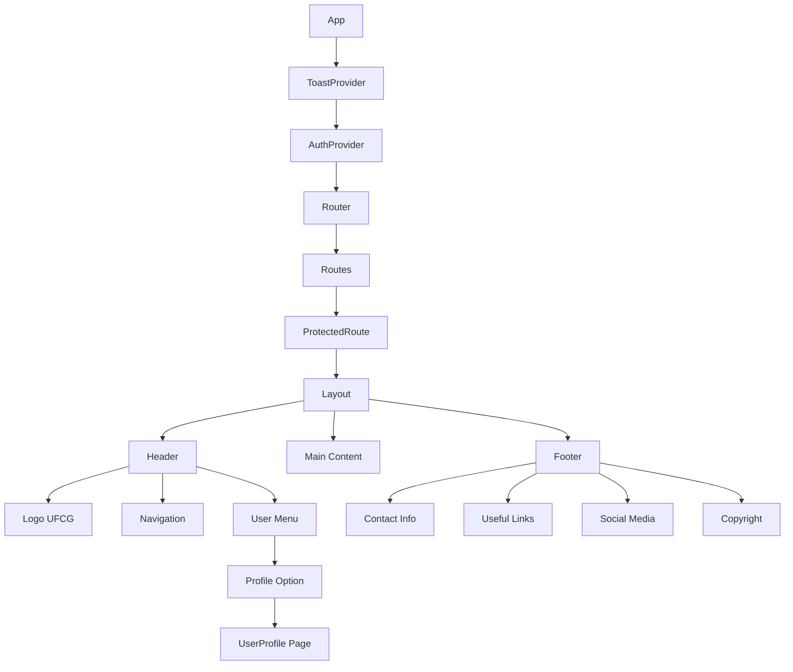

# Implementação de Header e Footer com Design UFCG e Tela de Perfil

## Overview

Este documento detalha a implementação de um novo design para o header e footer do sistema PatrimonioTools, seguindo os padrões visuais da Universidade Federal de Campina Grande (UFCG), além da criação de uma nova tela de perfil do usuário.

### Objetivos
- Redesenhar o header seguindo o padrão UFCG com logo institucional
- Implementar footer com informações institucionais e links úteis
- Criar tela de perfil do usuário acessível pelo menu do header
- Manter responsividade e acessibilidade

## Análise do Design UFCG

### Header UFCG Identificado
```
┌─────────────────────────────────────────────────────────────────┐
│ [Logo COMPROV] Comprov                [Logo UFCG] UNIVERSIDADE  │
│                Comissão de                        FEDERAL DE    │
│                Processos Vestibulares             CAMPINA GRANDE│
├─────────────────────────────────────────────────────────────────┤
│ Início | Resultados | Contato                                  │
└─────────────────────────────────────────────────────────────────┘
```

### Footer UFCG Identificado
```
┌─────────────────────────────────────────────────────────────────┐
│ Universidade Federal        Links Úteis        Redes Sociais    │
│ de Campina Grande                                                │
│                            Portal UFCG         [Facebook]       │
│ Endereço: Av. Aprígio      Comprov             [Twitter]        │
│ Veloso - 882, Bairro                           [Instagram]      │
│ Universitário | Campina                        [YouTube]        │
│ Grande - PB | CEP:                                              │
│ 58429-900 - Brasil                                              │
│                                                                 │
│ E-mail: secretaria@                                             │
│ comprov.ufcg.edu.br                                             │
│                                                                 │
│ Telefone: (83) 2101-1359                                        │
│ / 2101-1600                                                     │
├─────────────────────────────────────────────────────────────────┤
│ © 2025 Universidade Federal de Campina Grande.                 │
│ Todos os direitos reservados.                                   │
└─────────────────────────────────────────────────────────────────┘
```

## Component Architecture

### Arquitetura de Componentes


### Estrutura de Arquivos
```
frontend/src/
├── components/
│   ├── layout/
│   │   ├── Header.jsx (modificado)
│   │   ├── Footer.jsx (novo)
│   │   └── Layout.jsx (novo wrapper)
│   └── pages/
│       └── UserProfile.jsx (novo)
├── assets/
│   └── images/
│       ├── ufcg-logo.png (novo)
│       └── social-icons/ (novo)
└── routes/
    └── Routes.jsx (modificado)
```

## Header Redesign

### Design Requirements
- Logo UFCG no lado esquerdo
- Título "PatrimonioTools" com subtítulo institucional
- Menu de navegação central
- Menu do usuário no lado direito
- Cores e tipografia seguindo padrão UFCG

### Header Layout
```
┌─────────────────────────────────────────────────────────────────┐
│ [Logo UFCG] PatrimonioTools      Navigation     [User Avatar ▼] │
│             Sistema de Gestão                   Nome do Usuário │
└─────────────────────────────────────────────────────────────────┘
```

### Color Scheme UFCG
```css
:root {
  --ufcg-blue: #003366;
  --ufcg-light-blue: #0066cc;
  --ufcg-gray: #666666;
  --ufcg-light-gray: #f5f5f5;
  --ufcg-white: #ffffff;
}
```

### Header Component Specification

#### Props Interface
```typescript
interface HeaderProps {
  className?: string;
  showNavigation?: boolean;
  fixed?: boolean;
}
```

#### State Management
- `userMenuOpen: boolean` - controla abertura do menu do usuário
- `mobileMenuOpen: boolean` - controla menu mobile
- `user: object` - dados do usuário logado (via Context)

#### Features
1. **Logo UFCG**
   - Imagem institucional
   - Link para portal UFCG (externo)
   - Alt text apropriado

2. **Branding**
   - Título "PatrimonioTools"
   - Subtítulo "Sistema de Gestão"
   - Tipografia institucional

3. **Navigation Menu**
   - Links principais do sistema
   - Responsivo (collapsible em mobile)
   - Active state indicators

4. **User Menu**
   - Avatar do usuário
   - Nome e função
   - Dropdown com opções:
     - Meu Perfil
     - Configurações
     - Sair

## Footer Implementation

### Footer Sections

#### Seção 1: Informações Institucionais
```
Universidade Federal de Campina Grande

Endereço: Av. Aprígio Veloso - 882, Bairro Universitário
Campina Grande - PB | CEP: 58429-900 - Brasil

E-mail: contato@ufcg.edu.br
Telefone: (83) 2101-1000
```

#### Seção 2: Links Úteis
```
Links Úteis

Portal UFCG
Sistema Acadêmico
Biblioteca Central
Ouvidoria
```

#### Seção 3: Redes Sociais
```
Redes Sociais

[Facebook] Facebook da UFCG
[Twitter] Twitter da UFCG  
[Instagram] Instagram da UFCG
[YouTube] Canal do YouTube da UFCG
```

#### Seção 4: Copyright
```
© 2025 Universidade Federal de Campina Grande.
Todos os direitos reservados.
```

### Footer Component Specification

#### Layout Structure
```jsx
<footer className="bg-ufcg-blue text-white">
  <div className="container mx-auto px-4 py-8">
    <div className="grid grid-cols-1 md:grid-cols-3 gap-8">
      <InstitutionalInfo />
      <UsefulLinks />
      <SocialMedia />
    </div>
    <Copyright />
  </div>
</footer>
```

#### Responsive Behavior
- **Desktop**: 3 colunas lado a lado
- **Tablet**: 2 colunas com social media embaixo
- **Mobile**: 1 coluna com stack vertical

## User Profile Page

### Page Requirements
- Exibir informações detalhadas do usuário logado
- Permitir edição de dados pessoais
- Mostrar histórico de atividades
- Interface responsiva

### Profile Information Sections

#### Seção 1: Dados Pessoais
```
┌─────────────────────────────────────────┐
│ [Avatar]  Nome Completo                 │
│           username@sistema.com          │
│           Cargo/Função                  │
│           [Editar Perfil]               │
└─────────────────────────────────────────┘
```

#### Seção 2: Informações de Contato
```
┌─────────────────────────────────────────┐
│ Informações de Contato                  │
│                                         │
│ E-mail: usuario@email.com               │
│ Telefone: (83) 9999-9999               │
│ Matrícula: 123456789                   │
│ Data de Cadastro: 01/01/2024          │
└─────────────────────────────────────────┘
```

#### Seção 3: Configurações
```
┌─────────────────────────────────────────┐
│ Configurações                           │
│                                         │
│ [Toggle] Receber notificações por email│
│ [Toggle] Modo escuro                    │
│ [Button] Alterar senha                  │
│ [Button] Exportar dados                 │
└─────────────────────────────────────────┘
```

#### Seção 4: Atividades Recentes
```
┌─────────────────────────────────────────┐
│ Atividades Recentes                     │
│                                         │
│ • Login realizado - 01/01 às 14:30     │
│ • Responsável cadastrado - 31/12 às 16:45│
│ • Dados alterados - 30/12 às 09:15     │
│                                         │
│ [Ver todas as atividades]               │
└─────────────────────────────────────────┘
```

### UserProfile Component Specification

#### Component Structure
```jsx
const UserProfile = () => {
  const { user } = useAuth();
  const [editing, setEditing] = useState(false);
  const [profileData, setProfileData] = useState(user);
  
  return (
    <div className="max-w-4xl mx-auto p-6">
      <ProfileHeader />
      <div className="grid grid-cols-1 lg:grid-cols-2 gap-6">
        <PersonalInfo />
        <ContactInfo />
        <Settings />
        <RecentActivities />
      </div>
    </div>
  );
};
```

#### State Management
- `editing: boolean` - modo de edição ativo
- `profileData: object` - dados do perfil em edição
- `activities: array` - lista de atividades recentes
- `loading: boolean` - estado de carregamento

## Routing Integration

### Route Configuration
```jsx
// Routes.jsx
const routes = [
  {
    path: "/dashboard",
    element: <ProtectedRoute><Dashboard /></ProtectedRoute>
  },
  {
    path: "/profile", // Nova rota
    element: <ProtectedRoute><UserProfile /></ProtectedRoute>
  },
  {
    path: "/responsaveis",
    element: <ProtectedRoute><Responsaveis /></ProtectedRoute>
  }
];
```

### Navigation Integration
```jsx
// Header.jsx - User Menu
const userMenuItems = [
  {
    label: "Meu Perfil",
    icon: UserIcon,
    href: "/profile", // Link para nova página
    action: () => navigate('/profile')
  },
  {
    label: "Configurações",
    icon: SettingsIcon,
    href: "/settings"
  },
  {
    label: "Sair",
    icon: LogoutIcon,
    action: handleLogout,
    className: "text-red-600"
  }
];
```

## Layout Wrapper Component

### Layout Component Structure
```jsx
const Layout = ({ children }) => {
  return (
    <div className="min-h-screen flex flex-col">
      <Header />
      <main className="flex-1">
        {children}
      </main>
      <Footer />
    </div>
  );
};
```

### Layout Integration
```jsx
// App.jsx
<Routes>
  <Route path="/login" element={<Login />} />
  <Route path="/*" element={
    <Layout>
      <ProtectedRoutes />
    </Layout>
  } />
</Routes>
```

## Styling Strategy

### Tailwind CSS Extensions
```javascript
// tailwind.config.js
module.exports = {
  theme: {
    extend: {
      colors: {
        'ufcg': {
          'blue': '#003366',
          'light-blue': '#0066cc',
          'gray': '#666666',
          'light-gray': '#f5f5f5'
        }
      },
      fontFamily: {
        'institutional': ['Inter', 'sans-serif']
      }
    }
  }
}
```

### Component-Specific Styles
```css
/* Header styles */
.header-ufcg {
  @apply bg-ufcg-blue text-white shadow-lg;
}

.header-logo {
  @apply h-12 w-auto;
}

.header-title {
  @apply text-xl font-bold font-institutional;
}

/* Footer styles */
.footer-ufcg {
  @apply bg-ufcg-blue text-white;
}

.footer-section-title {
  @apply text-lg font-semibold mb-4;
}

.footer-link {
  @apply text-ufcg-light-gray hover:text-white transition-colors;
}

/* Profile styles */
.profile-card {
  @apply bg-white rounded-lg shadow-md p-6;
}

.profile-avatar {
  @apply w-24 h-24 rounded-full bg-ufcg-light-blue;
}
```

## Responsive Design

### Breakpoint Strategy
```css
/* Mobile First Approach */
.header-nav {
  @apply hidden md:flex; /* Hidden on mobile, visible on desktop */
}

.mobile-menu {
  @apply md:hidden; /* Visible on mobile, hidden on desktop */
}

.footer-grid {
  @apply grid-cols-1 md:grid-cols-2 lg:grid-cols-3;
}

.profile-grid {
  @apply grid-cols-1 lg:grid-cols-2;
}
```

### Mobile Considerations
- Header com menu hamburguer
- Footer com seções colapsáveis
- Profile com layout single-column
- Touch-friendly button sizes (min 44px)

## Testing Strategy

### Component Testing
```javascript
// Header.test.jsx
describe('Header Component', () => {
  test('renders UFCG logo', () => {
    render(<Header />);
    expect(screen.getByAltText('Logo UFCG')).toBeInTheDocument();
  });

  test('opens user menu on click', () => {
    render(<Header />);
    fireEvent.click(screen.getByRole('button', { name: /menu do usuário/i }));
    expect(screen.getByText('Meu Perfil')).toBeVisible();
  });
});

// Footer.test.jsx
describe('Footer Component', () => {
  test('renders institutional information', () => {
    render(<Footer />);
    expect(screen.getByText(/Universidade Federal de Campina Grande/i)).toBeInTheDocument();
  });

  test('renders social media links', () => {
    render(<Footer />);
    expect(screen.getByLabelText('Facebook da UFCG')).toBeInTheDocument();
  });
});

// UserProfile.test.jsx
describe('UserProfile Page', () => {
  test('displays user information', () => {
    render(<UserProfile />);
    expect(screen.getByText(/dados pessoais/i)).toBeInTheDocument();
  });

  test('allows editing profile', () => {
    render(<UserProfile />);
    fireEvent.click(screen.getByText('Editar Perfil'));
    expect(screen.getByDisplayValue(/nome atual/i)).toBeInTheDocument();
  });
});
```

### Integration Testing
```javascript
// Navigation.test.jsx
describe('Navigation Integration', () => {
  test('navigates to profile page from header menu', () => {
    render(<App />);
    
    // Login first
    login('testuser', 'password');
    
    // Click user menu
    fireEvent.click(screen.getByRole('button', { name: /menu do usuário/i }));
    
    // Click profile link
    fireEvent.click(screen.getByText('Meu Perfil'));
    
    // Verify navigation
    expect(screen.getByText(/dados pessoais/i)).toBeInTheDocument();
  });
});
```

## Performance Considerations

### Image Optimization
- Logo UFCG em formato WebP com fallback PNG
- Lazy loading para imagens de redes sociais
- Sprites para ícones pequenos

### Code Splitting
```javascript
// Lazy loading da página de perfil
const UserProfile = lazy(() => import('../pages/UserProfile'));

// Uso com Suspense
<Suspense fallback={<ProfileSkeleton />}>
  <UserProfile />
</Suspense>
```

### Bundle Optimization
- Tree shaking para ícones não utilizados
- Separação de CSS crítico e não-crítico
- Compression gzip/brotli

## Accessibility Features

### ARIA Labels
```jsx
// Header
<button 
  aria-label="Menu do usuário"
  aria-expanded={userMenuOpen}
  aria-controls="user-menu"
>

// Footer
<nav aria-label="Links úteis">
  <h3 id="useful-links">Links Úteis</h3>
  <ul aria-labelledby="useful-links">

// Profile
<main aria-label="Perfil do usuário">
  <h1 id="profile-title">Meu Perfil</h1>
```

### Keyboard Navigation
- Tab order lógico
- Focus indicators visíveis
- Escape para fechar menus
- Enter/Space para ativar botões

### Screen Reader Support
- Headings hierárquicos (h1, h2, h3)
- Alt text descritivo para imagens
- Labels associados a form controls
- Live regions para feedback dinâmico

## Implementation Priority

### Phase 1: Core Layout
1. ✅ Layout wrapper component
2. ✅ Header redesign with UFCG branding
3. ✅ Footer implementation
4. ✅ Basic routing integration

### Phase 2: User Profile
1. ✅ UserProfile page component
2. ✅ Profile information sections
3. ✅ Edit functionality
4. ✅ Navigation integration

### Phase 3: Polish & Testing
1. ✅ Responsive optimizations
2. ✅ Accessibility improvements
3. ✅ Performance optimizations
4. ✅ Comprehensive testing

## Browser Support

### Target Browsers
- Chrome 90+
- Firefox 88+
- Safari 14+
- Edge 90+

### Progressive Enhancement
- Base functionality sem JavaScript
- Enhanced UX com JavaScript habilitado
- Graceful degradation para browsers antigos

## Deployment Considerations

### Build Process
```bash
# Build otimizado
npm run build

# Verificação de bundle size
npm run analyze

# Test de produção
npm run preview
```

### Asset Management
- Versionamento de assets
- CDN para imagens estáticas
- Cache headers apropriados
- Service worker para cache offline