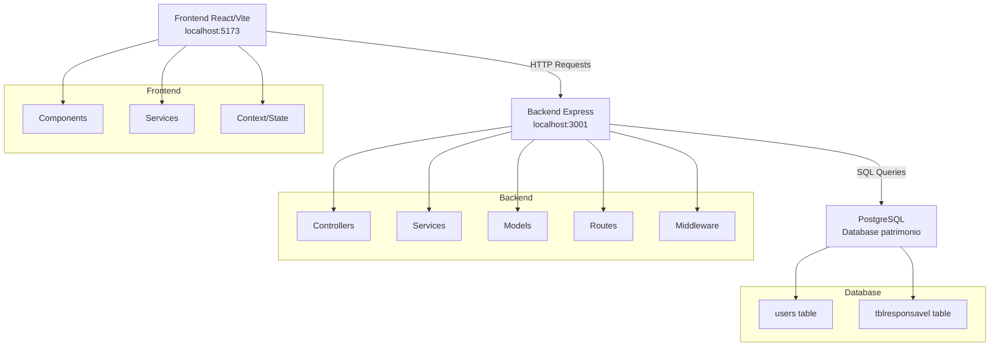
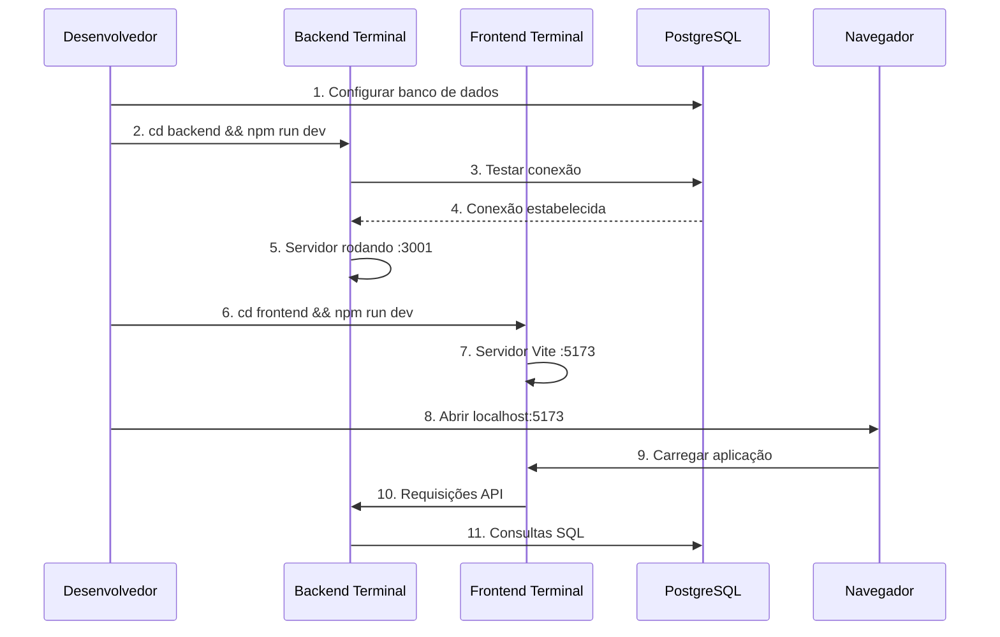

# Configuração de Ambiente Local para Testes

## Visão Geral

Este documento detalha o processo completo de configuração e execução dos serviços backend e frontend do sistema PatrimonioTools em ambiente local para desenvolvimento e testes. O sistema é uma aplicação full-stack que utiliza React com Tailwind CSS no frontend e Node.js com Express no backend, conectado a um banco de dados PostgreSQL.

## Tecnologias e Dependências

### Backend
- **Runtime**: Node.js 18+
- **Framework**: Express.js
- **Banco de Dados**: PostgreSQL 12+
- **Autenticação**: JWT (JSON Web Token)
- **Criptografia**: bcryptjs
- **Ferramenta de Desenvolvimento**: nodemon

### Frontend
- **Framework**: React 18+
- **Bundler**: Vite
- **Estilização**: Tailwind CSS
- **Roteamento**: React Router DOM
- **Cliente HTTP**: Axios
- **Linting**: ESLint

## Arquitetura do Sistema



## Pré-requisitos do Sistema

### Software Necessário

| Software | Versão Mínima | Descrição |
|----------|---------------|-----------|
| Node.js | 18.x | Runtime JavaScript |
| npm | 8.x | Gerenciador de pacotes |
| PostgreSQL | 12.x | Sistema de banco de dados |
| Git | 2.x | Controle de versão |

### Verificação de Instalação

```bash
# Verificar Node.js
node --version

# Verificar npm
npm --version

# Verificar PostgreSQL
psql --version
```

## Configuração do Banco de Dados

### 1. Criação do Banco de Dados

```sql
-- Conectar como superusuário PostgreSQL
CREATE DATABASE patrimonio;
CREATE USER patrimonio_user WITH PASSWORD 'sua_senha_segura';
GRANT ALL PRIVILEGES ON DATABASE patrimonio TO patrimonio_user;
```

### 2. Execução do Script de Inicialização

```bash
cd backend
psql -h localhost -U patrimonio_user -d patrimonio -f database-setup.sql
```

### 3. Estrutura das Tabelas

#### Tabela users
```sql
CREATE TABLE users (
    id SERIAL PRIMARY KEY,
    username VARCHAR(255) NOT NULL UNIQUE,
    password VARCHAR(255) NOT NULL,
    email VARCHAR(255),
    created_at TIMESTAMP DEFAULT CURRENT_TIMESTAMP,
    updated_at TIMESTAMP DEFAULT CURRENT_TIMESTAMP
);
```

#### Tabela tblresponsavel
```sql
CREATE TABLE tblresponsavel (
    id SERIAL PRIMARY KEY,
    matricula VARCHAR NOT NULL,
    permissao INTEGER NULL,
    nome VARCHAR NULL,
    CONSTRAINT uk_matricula UNIQUE (matricula)
);
```

## Configuração de Variáveis de Ambiente

### Backend (.env)

```env
# Configurações do Servidor
PORT=3001

# Configurações do Banco de Dados PostgreSQL
DB_HOST=localhost
DB_PORT=5432
DB_NAME=patrimonio
DB_USER=patrimonio_user
DB_PASSWORD=sua_senha_segura

# JWT Secret (gerar uma chave segura)
JWT_SECRET=sua_chave_jwt_muito_segura_aqui

# Configurações CORS
FRONTEND_URL=http://localhost:5173
```

### Frontend (.env)

```env
# URL da API do backend
VITE_API_URL=http://localhost:3001/api
```

### Geração de JWT Secret Seguro

```bash
# Usando Node.js
node -e "console.log(require('crypto').randomBytes(64).toString('hex'))"

# Usando OpenSSL
openssl rand -hex 64
```

## Processo de Instalação

### 1. Instalação das Dependências do Backend

```bash
cd backend
npm install
```

#### Dependências Principais do Backend
- express: Framework web
- pg: Driver PostgreSQL
- jsonwebtoken: Autenticação JWT
- bcryptjs: Hash de senhas
- dotenv: Variáveis de ambiente
- cors: Cross-Origin Resource Sharing

### 2. Instalação das Dependências do Frontend

```bash
cd frontend
npm install
```

#### Dependências Principais do Frontend
- react: Biblioteca UI
- react-dom: Renderização DOM
- react-router-dom: Roteamento
- axios: Cliente HTTP
- tailwindcss: Framework CSS

## Execução dos Serviços

### 1. Inicialização do Backend

```bash
cd backend

# Modo desenvolvimento (com nodemon)
npm run dev

# Modo produção
npm start
```

#### Verificação do Backend
- URL: `http://localhost:3001`
- Health Check: `GET http://localhost:3001/health`
- Console deve exibir: "✅ Servidor iniciado com sucesso!"

### 2. Inicialização do Frontend

```bash
cd frontend

# Servidor de desenvolvimento
npm run dev

# Build de produção
npm run build

# Preview do build
npm run preview
```

#### Verificação do Frontend
- URL: `http://localhost:5173`
- Interface de login deve ser carregada
- Console do navegador sem erros

### 3. Fluxo de Execução Completo



## Scripts de Execução Disponíveis

### Backend (package.json)

```json
{
  "scripts": {
    "start": "node src/index.js",
    "dev": "nodemon src/index.js",
    "test": "echo \"Error: no test specified\" && exit 1"
  }
}
```

### Frontend (package.json)

```json
{
  "scripts": {
    "dev": "vite",
    "build": "vite build",
    "preview": "vite preview",
    "lint": "eslint src --ext js,jsx"
  }
}
```

## Credenciais de Teste Padrão

### Usuário Administrador
- **Username**: `admin`
- **Password**: `admin123`
- **Email**: `admin@sistema.com`

### Dados de Teste
O sistema inclui 10 responsáveis de exemplo:
- João Silva Santos (JS001)
- Maria Oliveira Lima (MOL002)
- Pedro Costa Ferreira (PCF003)
- etc.

## Endpoints da API

### Autenticação
| Método | Endpoint | Descrição |
|--------|----------|-----------|
| POST | `/api/auth/login` | Login do usuário |
| GET | `/api/auth/validate` | Validar token JWT |
| POST | `/api/auth/logout` | Logout do usuário |

### Gestão de Responsáveis
| Método | Endpoint | Descrição |
|--------|----------|-----------|
| GET | `/api/responsaveis` | Listar responsáveis (com paginação) |
| GET | `/api/responsaveis/:id` | Buscar responsável por ID |
| GET | `/api/responsaveis/matricula/:matricula` | Buscar por matrícula |
| POST | `/api/responsaveis` | Criar novo responsável |
| PUT | `/api/responsaveis/:id` | Atualizar responsável |
| DELETE | `/api/responsaveis/:id` | Excluir responsável |

### Health Check
| Método | Endpoint | Descrição |
|--------|----------|-----------|
| GET | `/health` | Verificar status da API |

## Configuração de Portas

### Portas Padrão
- **Backend**: 3001
- **Frontend**: 5173
- **PostgreSQL**: 5432

### Personalização de Portas

```bash
# Backend
PORT=4000 npm run dev

# Frontend (Vite detecta automaticamente)
# Ou configurar em vite.config.js
export default defineConfig({
  server: {
    port: 3000
  }
})
```

## Resolução de Problemas Comuns

### Erro de Conexão com Banco de Dados

```bash
# Verificar status do PostgreSQL
sudo systemctl status postgresql

# Reiniciar PostgreSQL
sudo systemctl restart postgresql

# Testar conexão manual
psql -h localhost -U patrimonio_user -d patrimonio
```

### Erro de CORS

1. Verificar `FRONTEND_URL` no `.env` do backend
2. Confirmar que frontend está na porta 5173
3. Limpar cache do navegador

### Erro de JWT

1. Gerar nova `JWT_SECRET` segura
2. Verificar se não há caracteres especiais
3. Reiniciar servidor backend

### Erro de Dependências

```bash
# Limpar cache e reinstalar
rm -rf node_modules package-lock.json
npm install

# Verificar versões
npm ls
```

## Configuração para Desenvolvimento

### Hot Reload
- **Backend**: nodemon monitora alterações em `src/`
- **Frontend**: Vite HMR (Hot Module Replacement)

### Debugging
- **Backend**: Adicionar `--inspect` ao nodemon
- **Frontend**: React DevTools + Browser DevTools

### Logs
- **Backend**: Console logs estruturados
- **Frontend**: Console do navegador + Network tab

## Testes e Validação

### Checklist de Funcionalidades

#### Autenticação
- [ ] Login com credenciais corretas
- [ ] Rejeição de credenciais incorretas
- [ ] Redirecionamento automático
- [ ] Logout funcional

#### Dashboard
- [ ] Carregamento do dashboard
- [ ] Navegação para módulos
- [ ] Interface responsiva

#### Módulo Responsáveis
- [ ] Listagem com paginação
- [ ] Busca por nome/matrícula
- [ ] CRUD completo (Create, Read, Update, Delete)
- [ ] Validações de formulário

### Testes de API

```bash
# Health check
curl http://localhost:3001/health

# Login
curl -X POST http://localhost:3001/api/auth/login \
  -H "Content-Type: application/json" \
  -d '{"username":"admin","password":"admin123"}'

# Listar responsáveis
curl -H "Authorization: Bearer <token>" \
  http://localhost:3001/api/responsaveis
```

## Monitoramento e Logs

### Logs do Backend
```bash
# Seguir logs em tempo real
tail -f backend/logs/app.log

# Logs estruturados no console
npm run dev
```

### Logs do Frontend
- Console do navegador
- Network tab para requisições
- React DevTools para componentes

### Métricas de Performance
- Tempo de resposta da API
- Tempo de carregamento do frontend
- Uso de memória e CPU

## Configuração do .gitignore

### Arquivo .gitignore Principal (Raiz do Projeto)

```gitignore
# Dependências
node_modules/
npm-debug.log*
yarn-debug.log*
yarn-error.log*
pnpm-debug.log*
lerna-debug.log*

# Arquivos de ambiente (contêm informações sensíveis)
.env
.env.*
!.env.example

# Logs
logs
*.log

# Arquivos de sistema
.DS_Store
.DS_Store?
._*
.Spotlight-V100
.Trashes
ehthumbs.db
Thumbs.db

# IDEs e Editores
.vscode/
.idea/
*.swp
*.swo
*~

# Arquivos temporários
*.tmp
*.temp

# Builds e distribuição
dist/
build/
out/

# Cache
.npm
.eslintcache
.parcel-cache

# Cobertura de testes
coverage/
*.lcov

# Arquivos de banco de dados locais
*.db
*.sqlite
*.sqlite3

# Backups
*.bak
*.backup

# Arquivos de configuração local específicos
config/local.js
config/local.json

# Certificados SSL locais
*.pem
*.key
*.cert
*.crt

# Arquivos de upload de usuário (se aplicável)
uploads/
static/uploads/

# Documentação gerada
docs/build/
```

### .gitignore Específico do Backend

Criar arquivo `backend/.gitignore`:

```gitignore
# Dependências específicas do backend
node_modules/

# Arquivos de ambiente
.env
.env.local
.env.development
.env.production

# Logs do servidor
logs/
*.log

# Arquivos de sessão
sessions/

# Cache do banco de dados
db-cache/

# Arquivos de migração temporários
migrations/temp/

# Arquivos de backup do banco
*.sql.backup
*.dump

# Certificados e chaves
private/
certs/
*.pem
*.key

# Arquivos de configuração sensíveis
config/production.js
config/secrets.js
```

### .gitignore Específico do Frontend

Criar arquivo `frontend/.gitignore`:

```gitignore
# Dependências
node_modules/

# Build de produção
dist/
build/

# Cache do Vite
.vite/

# Arquivos de ambiente
.env
.env.local
.env.development.local
.env.test.local
.env.production.local

# Logs
npm-debug.log*
yarn-debug.log*
yarn-error.log*
pnpm-debug.log*
lerna-debug.log*

# Cache do ESLint
.eslintcache

# Arquivos de teste
coverage/

# Storybook
storybook-static/

# Arquivos temporários do editor
*.swp
*.swo

# Cache do navegador para testes
.cache/
```

### Arquivos .env.example

#### backend/.env.example

```env
# Configurações do Servidor
PORT=3001

# Configurações do Banco de Dados PostgreSQL
DB_HOST=localhost
DB_PORT=5432
DB_NAME=patrimonio
DB_USER=patrimonio_user
DB_PASSWORD=sua_senha_aqui

# JWT Secret (gerar uma chave segura)
JWT_SECRET=sua_chave_jwt_muito_segura_aqui

# Configurações CORS
FRONTEND_URL=http://localhost:5173

# Configurações de Desenvolvimento
NODE_ENV=development

# Configurações de Log
LOG_LEVEL=debug
```

#### frontend/.env.example

```env
# URL da API do backend
VITE_API_URL=http://localhost:3001/api

# Configurações de desenvolvimento
VITE_ENV=development

# Configurações de debug (opcional)
VITE_DEBUG=true
```

### Verificação do .gitignore

#### Comandos para Testar

```bash
# Verificar quais arquivos serão ignorados
git check-ignore -v arquivo_teste

# Listar todos os arquivos que serão commitados
git ls-files

# Verificar status do repositório
git status

# Verificar arquivos ignorados em um diretório
git check-ignore *
```

#### Limpeza de Arquivos Já Versionados

Se arquivos que deveriam ser ignorados já foram commitados:

```bash
# Remover do índice mas manter no sistema de arquivos
git rm --cached arquivo_sensivel

# Remover diretório do índice
git rm -r --cached node_modules/

# Adicionar .gitignore e commitar
git add .gitignore
git commit -m "Add .gitignore configuration"
```

### Boas Práticas

#### Arquivos que DEVEM ser Ignorados
- **Dependências**: `node_modules/`, arquivos de lock específicos do ambiente
- **Variáveis de Ambiente**: `.env`, `.env.local`, etc.
- **Builds**: `dist/`, `build/`, arquivos compilados
- **Logs**: `*.log`, diretórios de logs
- **Cache**: `.cache/`, `.vite/`, `.eslintcache`
- **Arquivos do Sistema**: `.DS_Store`, `Thumbs.db`
- **IDEs**: `.vscode/`, `.idea/`
- **Arquivos Temporários**: `*.tmp`, `*.swp`

#### Arquivos que DEVEM ser Versionados
- **Configurações de Exemplo**: `.env.example`
- **Configurações de Build**: `package.json`, `vite.config.js`
- **Configurações de Lint**: `.eslintrc.js`, `eslint.config.js`
- **Configurações de Estilo**: `tailwind.config.js`, `postcss.config.js`
- **Scripts de Banco**: `database-setup.sql`
- **Documentação**: `README.md`, `TESTING.md`

#### Estrutura de Arquivos Recomendada

```
PatrimonioTools/
├── .gitignore                 # Principal
├── .env.example              # Exemplo de variáveis
├── backend/
│   ├── .gitignore           # Específico do backend
│   ├── .env.example         # Exemplo para backend
│   └── src/
├── frontend/
│   ├── .gitignore           # Específico do frontend
│   ├── .env.example         # Exemplo para frontend
│   └── src/
└── docs/
    └── setup.md
```