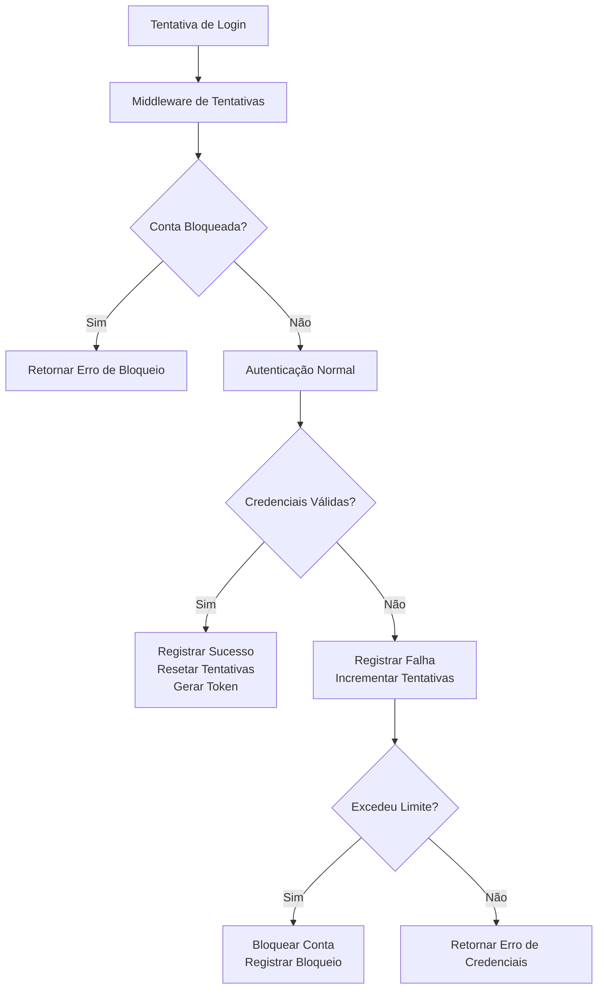
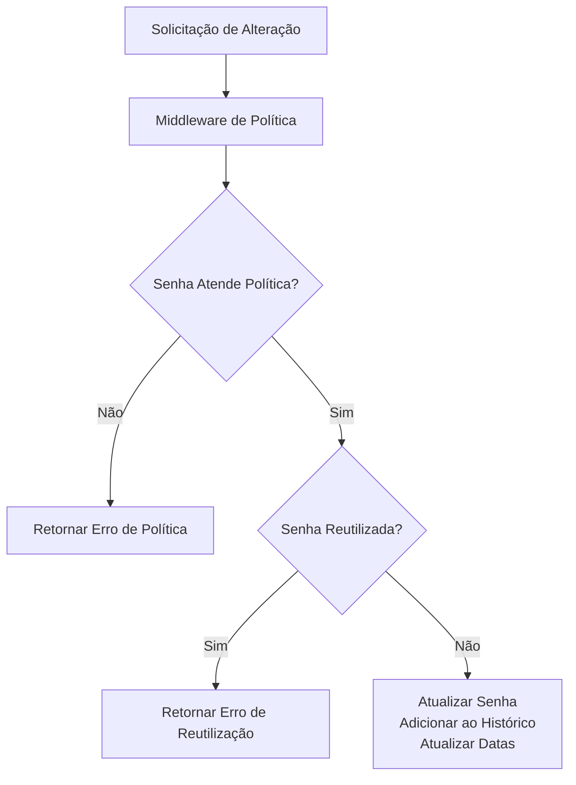

# Política de Segurança de Senhas

## 1. Visão Geral

Este documento descreve a implementação de uma política de segurança de senhas para o sistema PatrimonioTools, incluindo requisitos para senhas fortes, bloqueio por tentativas falhas e auditoria de acesso.

## 2. Arquitetura

A implementação seguirá a arquitetura existente do sistema, adicionando camadas de segurança no backend e frontend:

```
┌─────────────────┐    ┌────────────────────┐    ┌──────────────────┐
│   Frontend      │    │    Backend         │    │    Database      │
│                 │    │                    │    │                  │
│  LoginForm      │───▶│  AuthController    │───▶│  users           │
│  PasswordPolicy │    │  AuthService       │    │  login_attempts  │
│                 │    │  PasswordPolicy    │    │  audit_logs      │
│                 │    │  LoginAttempt      │    │                  │
└─────────────────┘    └────────────────────┘    └──────────────────┘
```

## 3. Requisitos Funcionais

### 3.1 Política de Senhas Fortes

- **Comprimento mínimo**: 8 caracteres
- **Complexidade**: Deve conter pelo menos:
  - Uma letra maiúscula
  - Uma letra minúscula
  - Um número
  - Um caractere especial (!@#$%^&*)
- **Troca periódica**: Forçar troca a cada 90 dias
- **Prevenção de reutilização**: Não permitir reutilização das últimas 5 senhas

### 3.2 Bloqueio por Tentativas Falhas

- **Limite de tentativas**: 5 tentativas consecutivas
- **Tempo de bloqueio**: 15 minutos após atingir o limite
- **Desbloqueio automático**: Após o tempo determinado
- **Notificação**: Registrar eventos de bloqueio

### 3.3 Auditoria e Logs de Acesso

- **Registro de tentativas**: Todas as tentativas de login (sucesso ou falha)
- **Registro de acessos**: Acessos ao sistema
- **Registro de ações sensíveis**: Alterações de senha, exclusão de registros
- **Armazenamento**: Logs mantidos por 180 dias

## 4. Modelos de Dados

### 4.1 Extensão da Tabela de Usuários

```sql
ALTER TABLE users ADD COLUMN IF NOT EXISTS 
  password_last_changed TIMESTAMP DEFAULT CURRENT_TIMESTAMP,
  password_expires_at TIMESTAMP DEFAULT CURRENT_TIMESTAMP + INTERVAL '90 days';
```

### 4.2 Tabela de Histórico de Senhas

```sql
CREATE TABLE IF NOT EXISTS password_history (
  id SERIAL PRIMARY KEY,
  user_id INTEGER REFERENCES users(id),
  password_hash VARCHAR(255) NOT NULL,
  created_at TIMESTAMP DEFAULT CURRENT_TIMESTAMP
);
```

### 4.3 Tabela de Tentativas de Login

```sql
CREATE TABLE IF NOT EXISTS login_attempts (
  id SERIAL PRIMARY KEY,
  username VARCHAR(255) NOT NULL,
  ip_address VARCHAR(45),
  success BOOLEAN NOT NULL,
  attempted_at TIMESTAMP DEFAULT CURRENT_TIMESTAMP,
  locked_until TIMESTAMP NULL
);
```

### 4.4 Tabela de Logs de Auditoria

```sql
CREATE TABLE IF NOT EXISTS audit_logs (
  id SERIAL PRIMARY KEY,
  user_id INTEGER REFERENCES users(id),
  action VARCHAR(100) NOT NULL,
  details TEXT,
  ip_address VARCHAR(45),
  created_at TIMESTAMP DEFAULT CURRENT_TIMESTAMP
);
```

## 5. Camada de Serviço

### 5.1 Serviço de Política de Senhas

Responsável por validar senhas e gerenciar histórico:

```javascript
class PasswordPolicyService {
  static validatePassword(password) { }
  static isPasswordExpired(userId) { }
  static addToPasswordHistory(userId, password) { }
  static isPasswordReused(userId, password) { }
}
```

### 5.2 Serviço de Tentativas de Login

Responsável por rastrear e controlar tentativas de login:

```javascript
class LoginAttemptService {
  static recordAttempt(username, ip, success) { }
  static isLocked(username, ip) { }
  static getRemainingAttempts(username, ip) { }
  static lockAccount(username, ip) { }
}
```

### 5.3 Serviço de Auditoria

Responsável por registrar eventos de segurança:

```javascript
class AuditService {
  static logEvent(userId, action, details, ip) { }
  static getLogs(filters) { }
}
```

## 6. Middleware de Segurança

### 6.1 Middleware de Validação de Senha

Intercepta requisições de alteração de senha para aplicar políticas:

```javascript
const passwordPolicyMiddleware = (req, res, next) => {
  // Validação de política de senha
  // Verificação de reutilização
  // Atualização de datas
};
```

### 6.2 Middleware de Bloqueio de Tentativas

Intercepta tentativas de login para verificar bloqueios:

```javascript
const loginAttemptMiddleware = (req, res, next) => {
  // Verificação de tentativas
  // Bloqueio de conta se necessário
};
```

## 7. Componentes do Frontend

### 7.1 Componente de Política de Senhas

Exibe requisitos de senha durante o registro/alteração:

```jsx
<PasswordPolicyIndicator password={password} />
```

### 7.2 Componente de Contador de Tentativas

Mostra tentativas restantes durante o login:

```jsx
<LoginAttemptCounter remainingAttempts={attempts} />
```

## 8. Fluxos de Trabalho

### 8.1 Fluxo de Login com Segurança



### 8.2 Fluxo de Alteração de Senha



## 9. API Endpoints

### 9.1 Endpoints de Autenticação Estendidos

- `POST /api/auth/login` - Login com verificação de tentativas
- `POST /api/auth/change-password` - Alteração com política de senhas
- `GET /api/auth/password-policy` - Obter política de senhas atual

### 9.2 Endpoints de Auditoria

- `GET /api/audit/logs` - Listar logs de auditoria
- `GET /api/audit/login-attempts` - Listar tentativas de login

## 10. Testes

### 10.1 Testes Unitários

- Validação de política de senhas
- Verificação de reutilização de senhas
- Controle de tentativas de login
- Registro de logs de auditoria

### 10.2 Testes de Integração

- Fluxo completo de login com bloqueio
- Fluxo completo de alteração de senha
- Geração e consulta de logs

## 11. Considerações de Segurança

1. **Armazenamento de Senhas**: Continuar usando bcrypt com salt
2. **Transmissão**: HTTPS obrigatório para todas as requisições
3. **Rate Limiting**: Implementar limitação adicional de requisições
4. **Proteção contra Brute Force**: Além do bloqueio, implementar delays progressivos

## 12. Considerações de Desempenho

1. **Índices de Banco**: Criar índices apropriados para consultas frequentes
2. **Limpeza de Dados**: Implementar rotinas para remover dados antigos
3. **Cache**: Utilizar cache para verificações frequentes