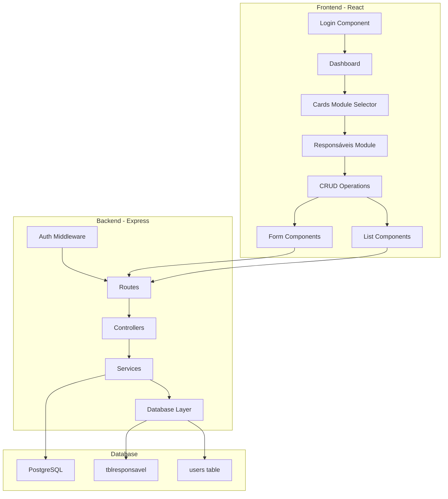
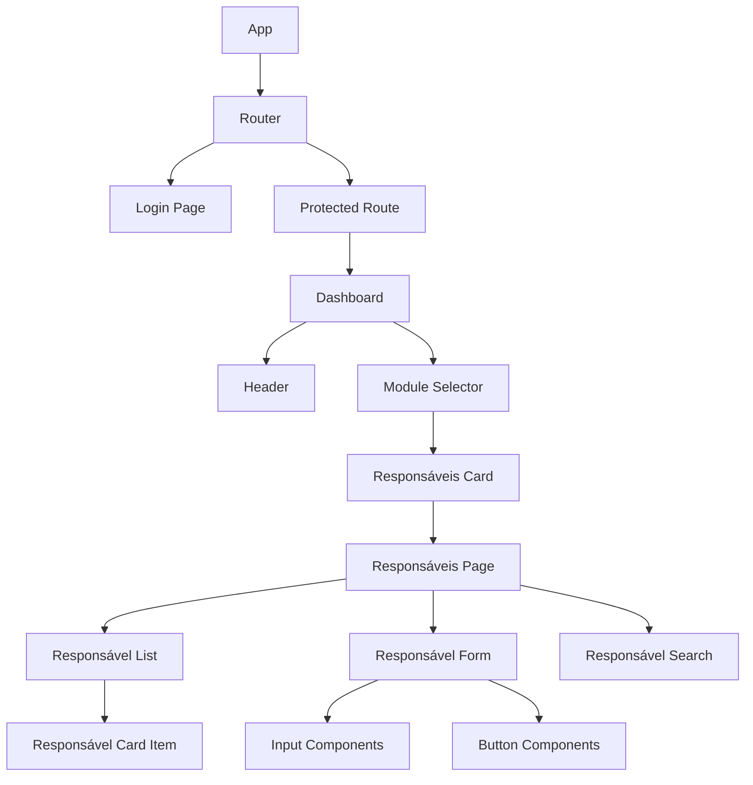
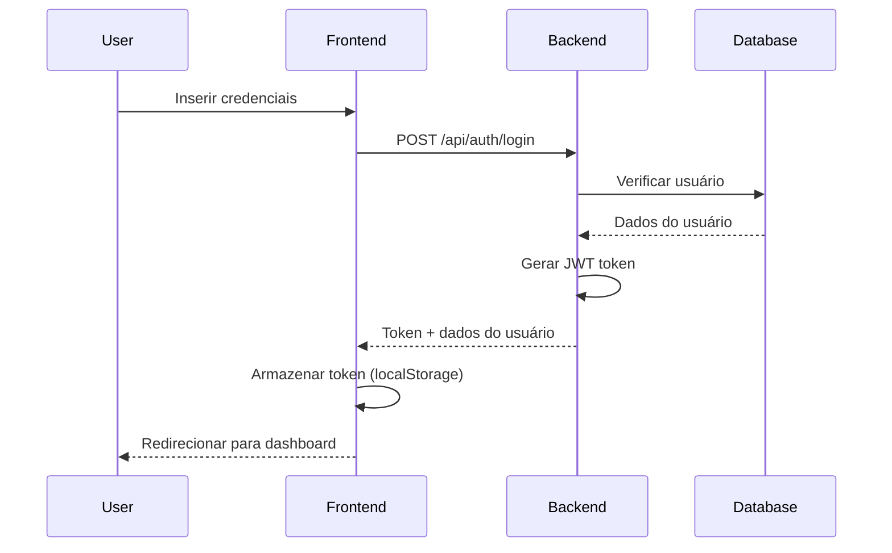
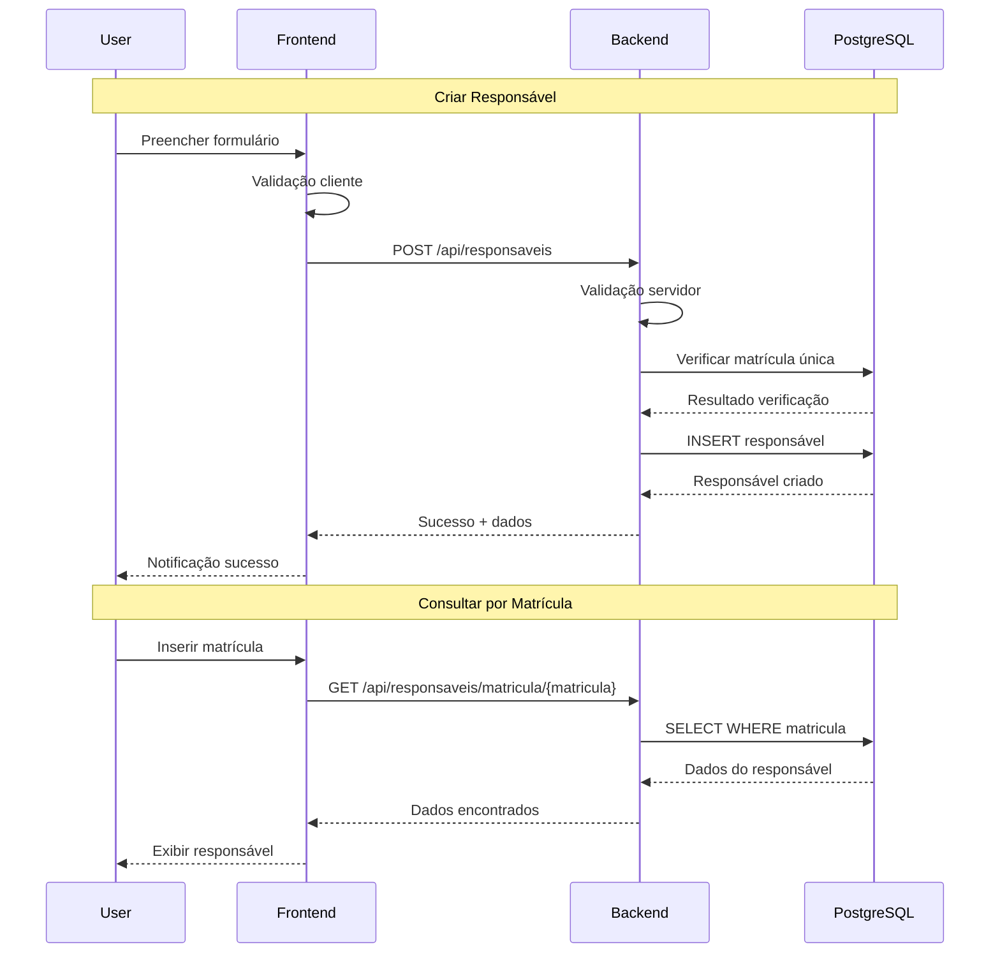
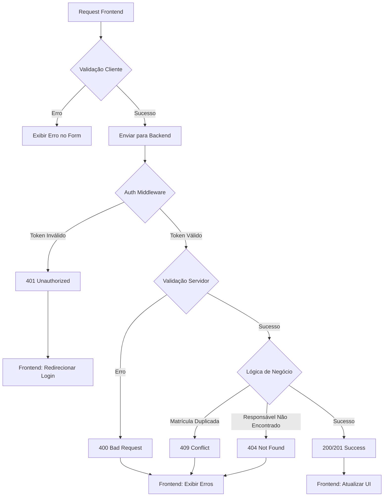

# Sistema Web de Cadastro de Responsáveis

## Overview

Sistema web full-stack para gerenciamento de responsáveis com funcionalidades CRUD completas. O sistema permitirá o cadastro, consulta, alteração e exclusão de responsáveis, além de autenticação e controle de acesso.

### Características Principais
- Interface responsiva para computadores e Mobile (smartphones) em formato de cards
- Sistema de autenticação e controle de acesso
- CRUD completo para responsáveis
- Consulta por matrícula
- Validação de duplicidade
- Design modular e escalável

### Tecnologias
- **Frontend**: React 18+, Tailwind CSS, CSS personalizado
- **Backend**: Node.js, Express.js
- **Banco de Dados**: PostgreSQL
- **Autenticação**: JWT
- **Validação**: Express Validator
- **ORM/Query Builder**: pg (node-postgres)

## Arquitetura

### Arquitetura Geral



## Frontend Architecture

### Estrutura de Componentes

```
src/
├── components/
│   ├── common/
│   │   ├── Card.jsx
│   │   ├── Button.jsx
│   │   ├── Input.jsx
│   │   ├── Modal.jsx
│   │   └── Loading.jsx
│   ├── auth/
│   │   ├── LoginForm.jsx
│   │   └── ProtectedRoute.jsx
│   ├── responsaveis/
│   │   ├── ResponsavelCard.jsx
│   │   ├── ResponsavelForm.jsx
│   │   ├── ResponsavelList.jsx
│   │   └── ResponsavelSearch.jsx
│   └── layout/
│       ├── Header.jsx
│       ├── Dashboard.jsx
│       └── ModuleSelector.jsx
├── pages/
│   ├── Login.jsx
│   ├── Dashboard.jsx
│   └── Responsaveis.jsx
├── services/
│   ├── api.js
│   ├── authService.js
│   └── responsavelService.js
├── context/
│   ├── AuthContext.jsx
│   └── ResponsavelContext.jsx
├── hooks/
│   ├── useAuth.js
│   └── useResponsaveis.js
└── utils/
    ├── validation.js
    └── constants.js
```

### Hierarquia de Componentes



### Gerenciamento de Estado

#### AuthContext
```javascript
{
  user: {
    id: number,
    username: string,
    token: string
  },
  isAuthenticated: boolean,
  login: function,
  logout: function,
  loading: boolean
}
```

#### ResponsavelContext
```javascript
{
  responsaveis: Array<Responsavel>,
  loading: boolean,
  error: string | null,
  selectedResponsavel: Responsavel | null,
  fetchResponsaveis: function,
  createResponsavel: function,
  updateResponsavel: function,
  deleteResponsavel: function,
  searchByMatricula: function
}
```

### Roteamento e Navegação

```javascript
// Estrutura de rotas
/login - Página de autenticação
/dashboard - Dashboard principal com seletor de módulos
/responsaveis - Módulo de gestão de responsáveis
/responsaveis/novo - Formulário de criação
/responsaveis/editar/:id - Formulário de edição
```

### Estratégia de Estilização

#### Tailwind CSS Classes
- **Cards**: `bg-white rounded-lg shadow-lg p-6 hover:shadow-xl transition-shadow`
- **Buttons**: `bg-blue-600 hover:bg-blue-700 text-white font-semibold py-2 px-4 rounded`
- **Forms**: `w-full px-3 py-2 border border-gray-300 rounded-md focus:outline-none focus:ring-2 focus:ring-blue-500`
- **Layout**: `container mx-auto px-4 py-8`

#### Componentes de UI Personalizados
- Card responsivo com hover effects
- Botões com estados loading
- Inputs com validação visual
- Modal para confirmações
- Toast notifications

### Camada de Integração com API

#### Configuração Base da API
```javascript
const API_BASE_URL = process.env.REACT_APP_API_URL || 'http://localhost:3001/api';

const apiClient = axios.create({
  baseURL: API_BASE_URL,
  headers: {
    'Content-Type': 'application/json',
  },
});
```

#### Serviços

##### ResponsavelService
```javascript
export const responsavelService = {
  getAll: () => apiClient.get('/responsaveis'),
  getByMatricula: (matricula) => apiClient.get(`/responsaveis/matricula/${matricula}`),
  create: (data) => apiClient.post('/responsaveis', data),
  update: (id, data) => apiClient.put(`/responsaveis/${id}`, data),
  delete: (id) => apiClient.delete(`/responsaveis/${id}`)
};
```

##### AuthService
```javascript
export const authService = {
  login: (credentials) => apiClient.post('/auth/login', credentials),
  logout: () => apiClient.post('/auth/logout'),
  validateToken: () => apiClient.get('/auth/validate')
};
```

### Estratégia de Testes

#### Testes de Componentes (Jest + React Testing Library)
```javascript
// Exemplo: ResponsavelForm.test.jsx
describe('ResponsavelForm', () => {
  test('deve validar campos obrigatórios', () => {
    render(<ResponsavelForm />);
    fireEvent.click(screen.getByText('Salvar'));
    expect(screen.getByText('Nome é obrigatório')).toBeInTheDocument();
  });
  
  test('deve exibir erro para matrícula duplicada', async () => {
    // Mock API response
    // Test duplicate validation
  });
});
```

#### Testes de Integração
- Fluxo completo de login
- Operações CRUD end-to-end
- Validação de rotas protegidas

## Backend Architecture

### Estrutura do Projeto

```
backend/
├── src/
│   ├── controllers/
│   │   ├── authController.js
│   │   └── responsavelController.js
│   ├── middleware/
│   │   ├── auth.js
│   │   ├── validation.js
│   │   └── errorHandler.js
│   ├── models/
│   │   ├── User.js
│   │   └── Responsavel.js
│   ├── routes/
│   │   ├── auth.js
│   │   └── responsaveis.js
│   ├── services/
│   │   ├── authService.js
│   │   ├── responsavelService.js
│   │   └── databaseService.js
│   ├── utils/
│   │   ├── jwt.js
│   │   └── validation.js
│   └── config/
│       ├── database.js
│       └── environment.js
├── tests/
└── package.json
```

### Endpoints da API

#### Autenticação

| Método | Endpoint | Descrição | Auth |
|--------|----------|-----------|------|
| POST | `/api/auth/login` | Login do usuário | Não |
| POST | `/api/auth/logout` | Logout do usuário | Sim |
| GET | `/api/auth/validate` | Validar token | Sim |

#### Responsáveis

| Método | Endpoint | Descrição | Auth |
|--------|----------|-----------|------|
| GET | `/api/responsaveis` | Listar todos os responsáveis | Sim |
| GET | `/api/responsaveis/:id` | Buscar responsável por ID | Sim |
| GET | `/api/responsaveis/matricula/:matricula` | Buscar por matrícula | Sim |
| POST | `/api/responsaveis` | Criar novo responsável | Sim |
| PUT | `/api/responsaveis/:id` | Atualizar responsável | Sim |
| DELETE | `/api/responsaveis/:id` | Excluir responsável | Sim |

#### Schemas de Request/Response

##### POST/PUT /api/responsaveis
```javascript
// Request Body
{
  "nome": "string (required, max 255)",
  "matricula": "string (required, unique)",
  "permissao": "integer (optional)"
}

// Response
{
  "success": true,
  "data": {
    "id": 1,
    "nome": "João Silva",
    "matricula": "12345",
    "permissao": 1
  },
  "message": "Responsável criado com sucesso"
}
```

##### GET /api/responsaveis
```javascript
// Response
{
  "success": true,
  "data": [
    {
      "id": 1,
      "nome": "João Silva",
      "matricula": "12345",
      "permissao": 1
    }
  ],
  "total": 1
}
```

### Modelos de Dados e Mapeamento ORM

#### Modelo Responsavel
```javascript
class Responsavel {
  constructor(data) {
    this.id = data.id;
    this.nome = data.nome;
    this.matricula = data.matricula;
    this.permissao = data.permissao;
  }

  static async findAll() {
    const query = 'SELECT * FROM tblresponsavel ORDER BY nome';
    const result = await db.query(query);
    return result.rows.map(row => new Responsavel(row));
  }

  static async findByMatricula(matricula) {
    const query = 'SELECT * FROM tblresponsavel WHERE matricula = $1';
    const result = await db.query(query, [matricula]);
    return result.rows[0] ? new Responsavel(result.rows[0]) : null;
  }

  async save() {
    if (this.id) {
      return this.update();
    } else {
      return this.create();
    }
  }

  async create() {
    const query = `
      INSERT INTO tblresponsavel (nome, matricula, permissao) 
      VALUES ($1, $2, $3) 
      RETURNING *
    `;
    const values = [this.nome, this.matricula, this.permissao];
    const result = await db.query(query, values);
    Object.assign(this, result.rows[0]);
    return this;
  }

  async update() {
    const query = `
      UPDATE tblresponsavel 
      SET nome = $1, matricula = $2, permissao = $3 
      WHERE id = $4 
      RETURNING *
    `;
    const values = [this.nome, this.matricula, this.permissao, this.id];
    const result = await db.query(query, values);
    Object.assign(this, result.rows[0]);
    return this;
  }

  async delete() {
    const query = 'DELETE FROM tblresponsavel WHERE id = $1';
    await db.query(query, [this.id]);
  }
}
```

### Camada de Lógica de Negócio

#### ResponsavelService
```javascript
class ResponsavelService {
  static async createResponsavel(data) {
    // Validar dados
    const validation = validateResponsavelData(data);
    if (!validation.isValid) {
      throw new ValidationError(validation.errors);
    }

    // Verificar se matrícula já existe
    const existing = await Responsavel.findByMatricula(data.matricula);
    if (existing) {
      throw new ConflictError('Matrícula já cadastrada');
    }

    // Criar responsável
    const responsavel = new Responsavel(data);
    return await responsavel.save();
  }

  static async updateResponsavel(id, data) {
    const responsavel = await Responsavel.findById(id);
    if (!responsavel) {
      throw new NotFoundError('Responsável não encontrado');
    }

    // Verificar matrícula duplicada (exceto o próprio registro)
    if (data.matricula !== responsavel.matricula) {
      const existing = await Responsavel.findByMatricula(data.matricula);
      if (existing) {
        throw new ConflictError('Matrícula já cadastrada');
      }
    }

    Object.assign(responsavel, data);
    return await responsavel.save();
  }

  static async deleteResponsavel(id) {
    const responsavel = await Responsavel.findById(id);
    if (!responsavel) {
      throw new NotFoundError('Responsável não encontrado');
    }

    await responsavel.delete();
    return { message: 'Responsável excluído com sucesso' };
  }
}
```

### Middleware e Interceptadores

#### Middleware de Autenticação
```javascript
const authMiddleware = (req, res, next) => {
  try {
    const token = req.header('Authorization')?.replace('Bearer ', '');
    
    if (!token) {
      return res.status(401).json({ 
        success: false, 
        message: 'Token de acesso requerido' 
      });
    }

    const decoded = jwt.verify(token, process.env.JWT_SECRET);
    req.user = decoded;
    next();
  } catch (error) {
    res.status(401).json({ 
      success: false, 
      message: 'Token inválido' 
    });
  }
};
```

#### Middleware de Validação
```javascript
const validateResponsavel = [
  body('nome')
    .notEmpty()
    .withMessage('Nome é obrigatório')
    .isLength({ max: 255 })
    .withMessage('Nome deve ter no máximo 255 caracteres'),
  
  body('matricula')
    .notEmpty()
    .withMessage('Matrícula é obrigatória')
    .matches(/^[A-Z0-9]+$/)
    .withMessage('Matrícula deve conter apenas letras maiúsculas e números'),
  
  body('permissao')
    .optional()
    .isInt({ min: 0, max: 10 })
    .withMessage('Permissão deve ser um número entre 0 e 10'),
];
```

#### Middleware de Tratamento de Erros
```javascript
const errorHandler = (err, req, res, next) => {
  console.error(err.stack);

  if (err instanceof ValidationError) {
    return res.status(400).json({
      success: false,
      message: 'Dados inválidos',
      errors: err.errors
    });
  }

  if (err instanceof ConflictError) {
    return res.status(409).json({
      success: false,
      message: err.message
    });
  }

  if (err instanceof NotFoundError) {
    return res.status(404).json({
      success: false,
      message: err.message
    });
  }

  res.status(500).json({
    success: false,
    message: 'Erro interno do servidor'
  });
};
```

### Testes Unitários

#### Testes de Controller
```javascript
describe('ResponsavelController', () => {
  describe('POST /api/responsaveis', () => {
    test('deve criar responsável com dados válidos', async () => {
      const responsavelData = {
        nome: 'João Silva',
        matricula: 'JS001',
        permissao: 1
      };

      const response = await request(app)
        .post('/api/responsaveis')
        .set('Authorization', `Bearer ${validToken}`)
        .send(responsavelData)
        .expect(201);

      expect(response.body.success).toBe(true);
      expect(response.body.data.nome).toBe(responsavelData.nome);
    });

    test('deve retornar erro para matrícula duplicada', async () => {
      // Setup: criar responsável
      await createTestResponsavel({ matricula: 'JS001' });

      const response = await request(app)
        .post('/api/responsaveis')
        .set('Authorization', `Bearer ${validToken}`)
        .send({ nome: 'Outro', matricula: 'JS001' })
        .expect(409);

      expect(response.body.success).toBe(false);
      expect(response.body.message).toContain('já cadastrada');
    });
  });
});
```

#### Testes de Serviço
```javascript
describe('ResponsavelService', () => {
  test('deve validar matrícula única', async () => {
    await ResponsavelService.createResponsavel({
      nome: 'João',
      matricula: 'JS001'
    });

    await expect(
      ResponsavelService.createResponsavel({
        nome: 'Maria',
        matricula: 'JS001'
      })
    ).rejects.toThrow('Matrícula já cadastrada');
  });
});
```

## Fluxo de Dados Entre Camadas

### Fluxo de Autenticação



### Fluxo CRUD de Responsáveis



### Fluxo de Validação e Tratamento de Erros

